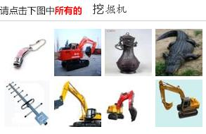
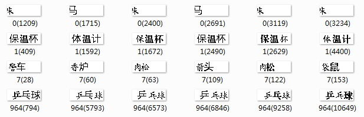
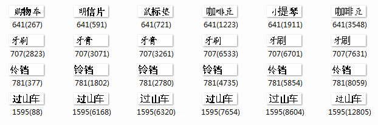

# easy12306
我在12306刚刚推出新验证码的时就候抓取了29,021张验证码图片。没想到很快12306就推出了升级版。但是本次实验仍然是建立在原始验证码图片上的。

## 原始数据说明
原始图像如下：

本次实验将原始数据存放在img目录下，并使用其MD5作为其文件名。

下载地址为：[原始验证码图像](http://pan.baidu.com/s/1dD6d90P)

## 第一步
对验证码中文字进行聚类，使用k-means算法。

### 具体步骤
从原图中提取文字部分，然后对文字进行二值化，然后将2维的图像向量化，然后直接使用k-means进行聚类。根据我的估算，验证码中有上千种物品，因此k=1000.

### 结果
经过28次迭代，若干小时…，终于有了结果。由于初始聚类中心是随机选取的，导致有些中心根本没有样本，而有些则聚集着大量不同的样本。1000个聚类中心，只有220个中心有样本。当然也有好的情况，对于大多数三字词聚类效果明显。以下是一些例子：

其中，第一行，一字词聚类效果一般；第二行，三字词，至少有一个字相同；第三行，二字词效果惨不忍睹；第四行是一个三字词的good case。

第二次尝试，使用训练数据的前k个样本作为初始聚类中心，经过17次迭代，算法收敛。对于二字词的效果有所改善，但是效果仍然不乐观，只有648个中心有样本。

第三次尝试，这次使用16k训练样本，1.6k聚类中心，使用简化的ISODATA算法。本次算法的改进之处：将没有样本的聚类中心移动至方差较大的地方聚类中心附近。为了简化计算，我假设每一个词出现的概率相等，从而认为聚集着较多点的中心方差就大。虽然相比之前有了长足的改善，但是效果仍然不是很理想，以下是一些例子：

第一行是一个三字词惨不忍睹的例子；第二行，把牙膏和牙刷分成了一组；第三行是一个二字词的好例子；第四行是一个三字词的好例子 。这次试验中，由于将聚类中心增加到1.6k，所以出现了一些明明是同一个词却被聚类到不同中心的情况。

第四次尝试，改用scikit-learn中的k-means实现，其效果很好，而且效率也很高。这次索性就对全部29k个样本进行聚类，聚类2k个中心，用时约32分钟。
